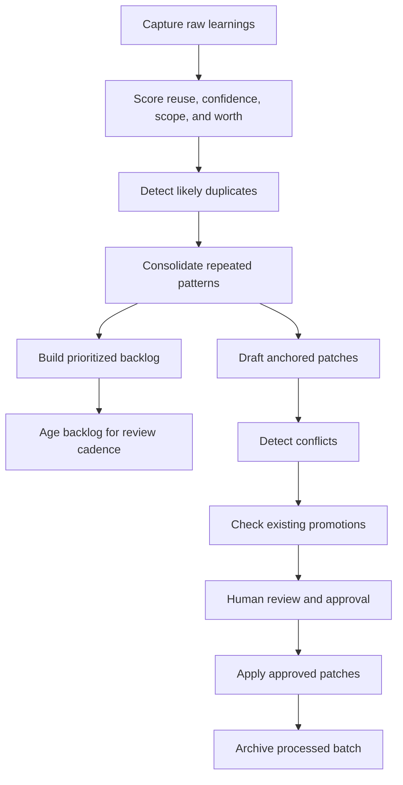

# claw-self-improving-plus


A conservative self-improvement workflow for OpenClaw agents, powered by the `learning-promoter` skill.

`claw-self-improving-plus` is the GitHub-facing project and repository.
`learning-promoter` is the core skill and promotion engine inside it.

The project captures mistakes, corrections, discoveries, decisions, and regressions, then turns them into structured learnings, deduplicated records, prioritized backlogs, and human-reviewed promotion patches.

Instead of letting an agent rewrite its own long-term rules too early, this project takes the safer route:

- capture first
- score second
- consolidate repeated patterns
- review before promotion
- apply only approved changes

That makes it useful for real workflows instead of turning memory into sludge.

## Why this project exists

Many self-improving agent projects optimize for autonomy too early.
This one is intentionally more conservative.

Most self-improving agent ideas fail for one simple reason: they optimize for autonomy before they earn trust.

This project does the opposite.

It treats self-improvement as a governed workflow:
- raw signals are captured first
- weak or one-off items stay raw
- repeated patterns are merged into stronger learnings
- strong candidates are ranked in a backlog
- long-term files change only after explicit approval

If you want an agent that learns without quietly polluting its own memory, this is the whole point.

## At a glance



## What it does

At the center of this repository is the `learning-promoter` skill.
It can:

- capture structured learning records into JSONL
- score records by reuse value, confidence, impact scope, and promotion worthiness
- detect likely duplicates before promotion
- consolidate repeated learnings into stronger merged records
- build a prioritized backlog for periodic review
- age the backlog so stale items do not dominate forever
- draft anchored patch candidates for long-term files
- detect patch conflicts before apply
- check whether a promotion already exists in target files
- require human approval before any long-term file edit
- apply only explicitly approved patches

## Who this is for

This repository is a good fit if you want to build OpenClaw or agent workflows that:

- improve over time without becoming reckless
- keep durable memory clean and intentional
- preserve an audit trail of why something was learned
- support human review instead of magical silent mutation
- work well in agent workspaces with files like `SOUL.md`, `AGENTS.md`, `TOOLS.md`, and `MEMORY.md`

## Core design stance

This project is deliberately conservative.

It does **not** assume that every observation deserves promotion.
It does **not** assume that every repeated pattern should become a permanent rule.
It does **not** assume that an agent should rewrite its long-term behavior without review.

The bias is toward signal, not clutter.

## Install the skill

This repository is the full GitHub project.

If you want to install the actual OpenClaw skill, use this directory:

```text
skill/learning-promoter/
```

That directory is the installable skill package.
The repository root is **not** the skill package.

If you are publishing to ClawHub, upload only the installable skill directory or a slim package built from it — not the whole repository.

## Repository layout

```text
.
|- README.md
|- LICENSE
|- RELEASE_NOTES.md
|- .gitignore
|- examples/
|- tests/
`- skill/
   `- learning-promoter/
      |- SKILL.md
      |- scripts/
      `- references/
```

## Default promotion targets

Out of the box, the skill is opinionated about where learnings should go:

- `SOUL.md` — durable voice, tone, and persona rules
- `AGENTS.md` — operating procedures, guardrails, workflows, failure-prevention rules
- `TOOLS.md` — environment-specific commands, model/tool preferences, local setup facts
- `MEMORY.md` — durable user, project, history, and decision records

If your setup uses a different workspace layout, update the routing and anchor rules in:

- `skill/learning-promoter/scripts/draft_patches.py`
- `skill/learning-promoter/scripts/apply_approved_patches.py`

## Quick start

From the repository root of this GitHub project:

### 1. Capture learnings

```bash
python3 skill/learning-promoter/scripts/capture_learning.py \
  --store .learnings/inbox.jsonl \
  --type correction \
  --summary "User prefers concise replies" \
  --details "Keep future responses brief by default." \
  --evidence "Explicitly stated by the user" \
  --source chat
```

### 2. Score them

```bash
python3 skill/learning-promoter/scripts/score_learnings.py \
  .learnings/inbox.jsonl \
  -o .learnings/scored.jsonl
```

### 3. Inspect merge candidates

```bash
python3 skill/learning-promoter/scripts/merge_candidates.py \
  .learnings/scored.jsonl \
  -o .learnings/merge.json
```

### 4. Consolidate repeated learnings

```bash
python3 skill/learning-promoter/scripts/consolidate_learnings.py \
  .learnings/scored.jsonl \
  .learnings/merge.json \
  -o .learnings/consolidated.jsonl
```

### 5. Build a prioritized backlog

```bash
python3 skill/learning-promoter/scripts/build_backlog.py \
  .learnings/consolidated.jsonl \
  -o .learnings/backlog.json
```

### 6. Age the backlog for periodic review

```bash
python3 skill/learning-promoter/scripts/age_backlog.py \
  .learnings/backlog.json \
  .learnings/consolidated.jsonl \
  -o .learnings/backlog-aged.json
```

### 7. Draft patch candidates

```bash
python3 skill/learning-promoter/scripts/draft_patches.py \
  .learnings/consolidated.jsonl \
  -o .learnings/patches.json
```

### 8. Detect patch conflicts

```bash
python3 skill/learning-promoter/scripts/detect_patch_conflicts.py \
  .learnings/patches.json \
  -o .learnings/conflicts.json
```

### 9. Review candidates

```bash
python3 skill/learning-promoter/scripts/review_patches.py \
  .learnings/patches.json list

python3 skill/learning-promoter/scripts/review_patches.py \
  .learnings/patches.json act --index 1 --action approve
```

### 10. Apply approved patches

```bash
python3 skill/learning-promoter/scripts/apply_approved_patches.py \
  .learnings/patches.json \
  --base-dir /path/to/agent-workspace \
  --dry-run \
  -o .learnings/apply-report.json
```

### 11. Check for existing promotions

```bash
python3 skill/learning-promoter/scripts/check_existing_promotions.py \
  .learnings/patches.json \
  --base-dir /path/to/agent-workspace
```

### 12. Render a cleaner review summary

```bash
python3 skill/learning-promoter/scripts/render_review.py \
  .learnings/patches.json
```

### 13. Review the backlog

```bash
python3 skill/learning-promoter/scripts/review_backlog.py \
  .learnings/backlog-aged.json --top 10
```

### 14. Or run the pipeline in one shot

```bash
python3 skill/learning-promoter/scripts/run_pipeline.py \
  .learnings/inbox.jsonl \
  --work-dir .learnings \
  --base-dir /path/to/agent-workspace \
  --archive-input
```

## What the pipeline produces

Recommended working directory:

```text
.learnings/
|- inbox.jsonl
|- scored.jsonl
|- merge.json
|- consolidated.jsonl
|- backlog.json
|- backlog-aged.json
|- patches.json
|- conflicts.json
|- existing-promotions.json
|- apply-report.json
`- archive/
```

### File roles

- `inbox.jsonl` — append-only raw learning capture
- `scored.jsonl` — normalized and scored records
- `merge.json` — likely duplicate groups
- `consolidated.jsonl` — stronger merged records after dedup
- `backlog.json` — ranked promotion backlog
- `backlog-aged.json` — backlog with freshness / aging / staleness signals
- `patches.json` — reviewable patch candidates
- `conflicts.json` — patch collision and duplication warnings
- `existing-promotions.json` — checks for already-promoted content in target files
- `apply-report.json` — apply audit trail
- `archive/` — processed inbox batches

## Example workflow

A practical loop looks like this:

1. Capture raw lessons during work
2. Run the pipeline on a batch
3. Review top backlog items
4. Review patch candidates
5. Approve only the durable, high-signal items
6. Apply approved patches with `--dry-run` first
7. Archive the processed batch
8. Repeat later instead of trying to auto-promote everything immediately

That rhythm is the difference between useful self-improvement and self-inflicted chaos.

## Safety model

This project is built around one non-negotiable rule:

**Long-term behavior and memory files should not change silently.**

The safety posture is:

- human review before durable promotion
- explicit approval before apply
- conflict detection before writes
- duplicate-promotion checks before apply
- dry-run support for verification
- conservative routing to long-term files

If you want an agent to evolve safely, these constraints are not optional. They are the product.

## Examples

See `examples/` for sample learning stores and edge cases:

- `inbox.sample.jsonl`
- `phase2-sample.jsonl`
- `near-duplicates.jsonl`
- `backlog-aging.jsonl`

## Tests

This repository includes tests because this is a logic-heavy skill, not just a prompt wrapper.

Run them from the repository root:

```bash
python3 tests/test_learning_promoter.py
```

If a self-improving system has no tests, it is basically asking you to trust vibes. Bad plan.

## Portability

The scripts avoid hardcoded local workspace paths.

The main runtime input you provide is:

- `--base-dir` when checking or applying promotions against a real workspace

This keeps the skill portable across different agent setups while still supporting anchored promotion behavior.

## Packaging

If your agent platform supports packaged skills, package this directory:

```text
skill/learning-promoter/
```

The repository intentionally keeps GitHub-facing files at the repo root and the actual skill package under `skill/learning-promoter/`, so the distributable skill stays clean.

## Release notes

See `RELEASE_NOTES.md` for version history and milestone summaries.

## License

MIT License.
